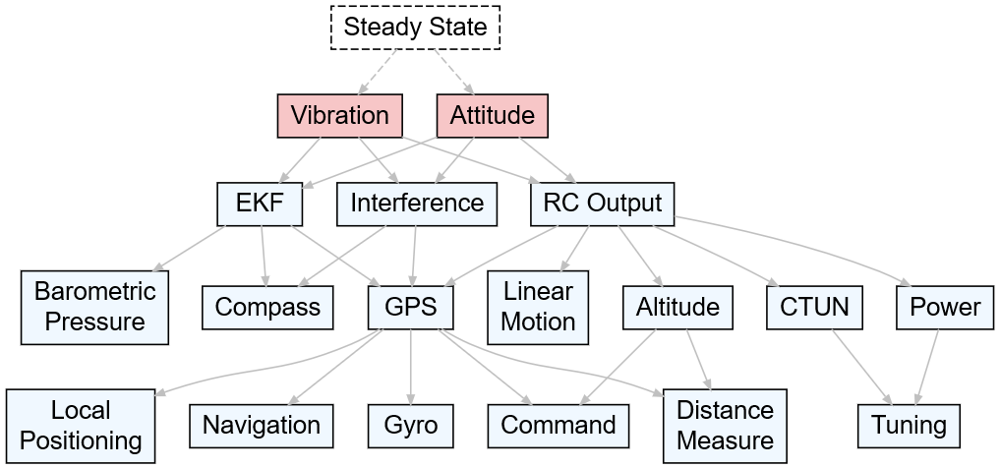

# Hierarchical Anomaly Detection in small Uncrewed Aerial Systems using a Metaphoric Canary

##### Canaries in this framework act as early-warning indicators for potential drone anomalies, much like their historical use in coal mines to detect harmful gases. They monitor key parameters such as vibration, attitude, and other critical subsystems that can cascade into larger failures if left unchecked. By detecting deviations in these parameters, the system can trigger targeted diagnostics, helping to identify underlying issues like mechanical faults, sensor errors, or environmental disturbances.

## L1: Steady State Canary Nodes

##### The pink colored canary nodes continually run in the background to detect either vibration or attitude-related anomalies. Together, these two types of anomalies are early indicators of other commonly occurring anomalies. They therefore serve as an early-warning canary, resulting in the triggering of next-level anomalies.

### Vibration
##### Vibration anomalies serve as early indicators of mechanical or structural issues. Excessive vibration can stem from propeller imbalances, motor issues, or loose components, which may degrade sensor accuracy, particularly in IMUs (Inertial Measurement Units). These degraded measurements can cause cascading failures in state estimation, navigation, and control systems.

| **Platform** | **Rules for Triggering Alert**                                         |
|--------------|------------------------------------------------------------------------|
| **ArduPilot** | `VIBE.{VibeX, VibeY, VibeZ}` Values > 30 ms²                       |
| **PX4**      | `sensor_accel` Std dev > 30 ms²                                     |

- **Parent Links**: None (Root Node)
- **Child Links**: L2_EKF, L2_Interference, L2_RCOutput

---

### Attitude
##### Attitude anomalies highlight discrepancies between the drone's actual orientation and its desired orientation, often caused by external disturbances, faulty sensors, or control system errors. Significant divergence in roll, pitch, or yaw can lead to instability or loss of control. 

| **Platform** | **Rules for Triggering Alert**                                         |
|--------------|------------------------------------------------------------------------|
| **ArduPilot** | `ATT.{Roll, Pitch, Yaw}`, `ATT.Des{Roll, Pitch, Yaw}` Divergence > 10° |
| **PX4**      | `vehicle_attitude`, `vehicle_attitude_setpoint` Divergence > 10°     |

- **Parent Links**: None (Root Node)
- **Child Links**: L2_EKF, L2_Interference, L2_RCOutput

---

## L2: EKF
##### The Extended Kalman Filter (EKF) contains numerous attributes that serve as intermediate indicators of other problems. It is typically not itself the source of a problem but rather highlights anomalies in state estimation, such as sensor inconsistencies or environmental influences. This node therefore serves as an intermediate node that triggers child detectors without directly diagnosing problems.

| **Platform** | **Rules for Triggering Alert**                                         |
|--------------|------------------------------------------------------------------------|
| **ArduPilot** | `EKF3.{IP, IV, IM}` `EKF4.{SP, SV, SM, SH, SVT}` `EKF3.IP, IV` outside [-1,1] `EKF4` outside [-0.5, 0.5] |
| **PX4**      | `estimator_innovations[:]` Innovations outside [-1,1]               |

- **Parent Links**: L1_Canary
- **Child Links**: L3_Pressure, L3_Compass, L3_GPS

---

## L2: Interference
##### Compass interference on drones typically occurs when the onboard magnetometer (commonly referred to as the compass) is affected by electromagnetic fields (EMFs) or magnetic sources in the vicinity of the drone. This interference can lead to incorrect heading readings, causing navigation and control issues.
TBD

| **Platform** | **Rules for Triggering Alert**                                         |
|--------------|------------------------------------------------------------------------|
| **ArduPilot** | `CTUN.ThO`, `MAG.{MagX, MagY, MagZ}` `MAG-ThO corr > 50%`          |
| **PX4**      | `sensor_mag.{x, y, z}`, `actuator_control[3]` `Corr > 50%`         |

- **Parent Links**: L1_Canary
- **Child Links**: L3_Compass, L3_GPS

---

## L2: RC Output
##### RC output errors indicate extreme compensations by the flight controller, such as PWM channels reaching their limits. These errors often result from mechanical issues like motor or propeller failures, control system instability, or environmental disturbances such as strong winds. Detecting RC output anomalies early helps prevent escalating instability or complete loss of control in the drone's operation.
| **Platform** | **Rules for Triggering Alert**                                         |
|--------------|------------------------------------------------------------------------|
| **ArduPilot** | `RCOU.{C1:C6}` Channels reach min/max PWM                         |
| **PX4**      | `actuator_outputs[0:5]` Outputs reach min/max PWM                  |

- **Parent Links**: L1_Canary
- **Child Links**: L3_GPS, L3_LM, L3_Alt, L3_Power, L3_CTUN

---

## L3: Barometric pressure
##### The Pressure node monitors the barometric sensor, which provides critical altitude data for the drone's stability and navigation. Alerts are triggered by sudden pressure changes, discrepancies between barometric and GPS altitude, or sensor health flags (e.g., BARO_HEALTH in ArduPilot or BARO_FAIL in PX4). Anomalies in barometric pressure can disrupt altitude estimation, directly impacting the EKF and overall flight stability.

| **Platform** | **Rules for Triggering Alert**                                         |
|--------------|------------------------------------------------------------------------|
| **ArduPilot** |                                                                        |
| **PX4**      |                                                                        |

- **Parent Links**: L2_EKF
- **Child Links**: None

---

## L3: Compass
##### The Compass node monitors the magnetometer, which provides critical heading information. Anomalies may arise from magnetic interference, sensor malfunctions, or calibration issues, potentially leading to incorrect navigation or instability. These errors can propagate to higher-level navigation and control systems.

| **Platform** | **Rules for Triggering Alert**                                         |
|--------------|------------------------------------------------------------------------|
| **ArduPilot** |                                                                        |
| **PX4**      |                                                                        |

- **Parent Links**: L2_EKF, L2_Interference
- **Child Links**: None

---

## L3: GPS
##### The GPS node monitors satellite-based positioning data essential for navigation. Anomalies include low satellite count, high horizontal or vertical dilution of precision (HDOP/VDOP), or signal noise and jamming. These errors can affect position accuracy and timing, compromising overall flight stability.

| **Platform** | **Rules for Triggering Alert**                                         |
|--------------|------------------------------------------------------------------------|
| **ArduPilot** | `GPS.{NSats, HDop}` NSats < 12 or HDop > 1.2                      |
| **PX4**      | `vehicle_gps_position.{satellites_used, hdop, vdop, noise, jamming}` Satellites < 12 or hdop > 1.2 vdop > 2 or noise > 120 jamming > 40 |

- **Parent Links**: L2_EKF, L2_Interference, L2_RCOutput
- **Child Links**: L4_LP, L4_Nav, L4_Gyro, L4_Command, L4_DM

---

## L3: Linear Motion
##### The Linear Motion node monitors the drone's acceleration and velocity along its primary axes. Anomalies in linear motion may indicate external forces, mechanical faults, or inconsistencies in sensor readings, which can affect the drone's stability and trajectory.

| **Platform** | **Rules for Triggering Alert**                                         |
|--------------|------------------------------------------------------------------------|
| **ArduPilot** |                                                                        |
| **PX4**      |                                                                        |

- **Parent Links**: L2_RCOutput
- **Child Links**: None

---

## L3: Altitude
##### The Altitude node monitors the drone's altitude estimates derived from barometric pressure, GPS, and other sensors. Anomalies can result from sensor drift, environmental factors, or sensor disagreements, leading to flight instability or failure to maintain desired altitude.

| **Platform** | **Rules for Triggering Alert**                                         |
|--------------|------------------------------------------------------------------------|
| **ArduPilot** |                                                                        |
| **PX4**      |                                                                        |

- **Parent Links**: L2_RCOutput
- **Child Links**: L4_Command, L4_DM

---

## L3: Power
##### The Power node monitors the drone's electrical system, including battery voltage and current. Rapid drops in voltage or abnormal power consumption can indicate battery issues, wiring faults, or overdrawn loads, potentially leading to sudden power loss or flight termination.

| **Platform** | **Rules for Triggering Alert**                                         |
|--------------|------------------------------------------------------------------------|
| **ArduPilot** | `BAT.{Curr, Volt}` Slope < -0.05                                   |
| **PX4**      | `battery_status.{voltage_v, current_a}` Slope < -0.05              |

- **Parent Links**: L2_RCOutput
- **Child Links**: L4_Tuning

---

## L3: CTUN
##### The CTUN node monitors control tuning parameters and feedback. Anomalies in this node may indicate instability in the drone’s control loops or mismatched control responses, which could affect flight stability and precision.

| **Platform** | **Rules for Triggering Alert**                                         |
|--------------|------------------------------------------------------------------------|
| **ArduPilot** |                                                                        |
| **PX4**      |                                                                        |

- **Parent Links**: L2_RCOutput
- **Child Links**: L4_Tuning

---

## L4: Leaf Nodes
### Local Positioning
##### The LP node monitors the drone's local position estimates, which are essential for navigation and obstacle avoidance. Errors in local positioning can lead to misalignment with the planned trajectory or collisions.

| **Platform** | **Rules for Triggering Alert**                                         |
|--------------|------------------------------------------------------------------------|
| **ArduPilot** |                                                                        |
| **PX4**      |                                                                        |

- **Parent Links**: L3_GPS
- **Child Links**: None

### Navigation
##### The Navigation node monitors navigation commands and feedback to ensure adherence to the planned mission path. Anomalies may indicate control system issues or unexpected environmental influences affecting navigation.

| **Platform** | **Rules for Triggering Alert**                                         |
|--------------|------------------------------------------------------------------------|
| **ArduPilot** |                                                                        |
| **PX4**      |                                                                        |

- **Parent Links**: L3_GPS
- **Child Links**: None

### Gyro
##### The Gyro node monitors gyroscopic data critical for angular velocity measurements and drone stabilization. Anomalies in gyro readings can lead to incorrect attitude estimates, resulting in instability.

| **Platform** | **Rules for Triggering Alert**                                         |
|--------------|------------------------------------------------------------------------|
| **ArduPilot** |                                                                        |
| **PX4**      |                                                                        |

- **Parent Links**: L3_GPS
- **Child Links**: None

### Command
##### The Command node monitors mission-critical commands such as takeoff, land, or waypoint navigation. Errors in command execution can indicate systemic failures or conflicts in higher-level mission planning.

| **Platform** | **Rules for Triggering Alert**                                         |
|--------------|------------------------------------------------------------------------|
| **ArduPilot** |                                                                        |
| **PX4**      |                                                                        |

- **Parent Links**: L3_GPS, L3_Altitude
- **Child Links**: None

### Distance Measure
##### Unexpected or erroneous deviations in measurements related to distances during UAV operations. These anomalies can stem from a variety of causes and are critical to detect and manage to maintain safe and reliable UAV performance

| **Platform** | **Rules for Triggering Alert**                                         |
|--------------|------------------------------------------------------------------------|
| **ArduPilot** |                                                                        |
| **PX4**      |                                                                        |

- **Parent Links**: L3_GPS, L3_Altitude
- **Child Links**: None

### Tuning
##### The Tuning node monitors the parameters related to drone control tuning. Anomalies may indicate issues with mismatched gains or control feedback loops, leading to oscillations or erratic behavior.

| **Platform** | **Rules for Triggering Alert**                                         |
|--------------|------------------------------------------------------------------------|
| **ArduPilot** |                                                                        |
| **PX4**      |                                                                        |

- **Parent Links**: L3_Power, L3_CTUN
- **Child Links**: None

